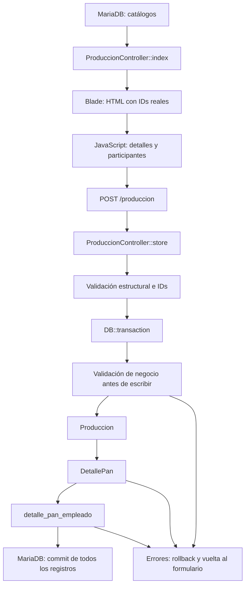

# Sprint 5 — Implementación de store() para Producción de Pan

Fecha de revisión documental: **2026-10-05**.
Estado del guardado HTTP de Pan: **IMPLEMENTADO Y COMPROBADO en MariaDB aislada**.
Estado de la prueba manual completa en navegador: **PENDIENTE**.

Este informe describe el código actual del checkout y la evidencia de pruebas ya obtenida en la tarea anterior. Se crea como informe técnico nuevo, solicitado en la raíz del proyecto, para revisar Sprint 5 y preparar posteriormente material didáctico de Obsidian. No reemplaza ni modifica informes anteriores ni notas del Vault.

En esta tarea documental no se modifica código, no se modifican tests, no se ejecutan pruebas Laravel, migraciones o seeders y no se consulta ni altera la base de datos. Los resultados de persistencia citados corresponden a la ejecución anterior, confirmada en la conversación; no se presentan como una ejecución nueva.

## 1. Objetivo de esta fase

La fase conecta el formulario preparado para Pan con un guardado real y consistente. Una petición registra una producción de una sola familia, con fecha y turno comunes, uno o varios detalles de Pan y los participantes de cada detalle.

El resultado esperado es una cabecera en `produccion`, sus filas en `detalle_pan` y las asociaciones de empleados en `detalle_pan_empleado`. Todos estos registros se guardan juntos o se revierten juntos.

La implementación reutiliza modelos, relaciones, tablas y rutas existentes. La validación está en `ProduccionController`; no se ha creado un FormRequest ni un Service de producción para esta fase. Tener un modelo o una pestaña de Torta/Bocadito no significa que su registro HTTP esté implementado: `store()` los rechaza.

## 2. Fuentes actuales y responsabilidades

| Fuente revisada | Responsabilidad en el flujo |
|---|---|
| [ProduccionController.php](app/Http/Controllers/ProduccionController.php) | Cargar catálogos, validar Pan y escribir cabecera, detalles y participantes. |
| [index.blade.php](resources/views/produccion/index.blade.php) | Generar el formulario HTML con IDs reales, detalles repetibles y participantes anidados. |
| [produccion.js](resources/js/produccion.js) | Gestionar bloques, índices, participantes, ayuda de cantidades, familias y cancelación. |
| [ProduccionPanStoreTest.php](tests/Feature/ProduccionPanStoreTest.php) | Verificar el POST, los valores persistidos, los rechazos y el rollback. |
| [NavigationTest.php](tests/Feature/NavigationTest.php) | Verificar navegación, protección de rutas, sesión y estructura básica del formulario. |
| [Produccion.php](app/Models/Produccion.php) | Representar la cabecera y su relación `hasMany` con detalles. |
| [DetallePan.php](app/Models/DetallePan.php) | Representar un detalle y su relación con producto, unidad, turno, producción y empleados. |
| [Producto.php](app/Models/Producto.php) | Proporcionar familia, estado activo, unidad y factor vigente del producto. |
| [Categoria.php](app/Models/Categoria.php) | Identificar la familia por su nombre y relacionar productos/producciones. |
| [Turno.php](app/Models/Turno.php) | Proporcionar el catálogo de turnos y sus relaciones. |
| [Empleado.php](app/Models/Empleado.php) | Representar la persona y su cargo; el cargo no determina su rol en un detalle. |
| [RolProduccion.php](app/Models/RolProduccion.php) | Representar el catálogo de funciones operativas en producción. |
| [DetallePanEmpleado.php](app/Models/DetallePanEmpleado.php) | Representar el pivot con empleado, detalle y rol operativo. |

También se leen `UnidadMedida.php`, `routes/web.php`, los seeders pertinentes, `tests/Support/IsolatedMariaDb.php`, `tests/run-mariadb.php` y las migraciones que describen las columnas, foreign keys, snapshot y restricciones de Pan. Leer una migración no equivale a ejecutarla ni a inspeccionar el esquema de una base compartida.

El informe previo `sprint5_auditoria_entrada_produccion.md` conserva el diagnóstico anterior a la implementación. Sus afirmaciones sobre un `store()` vacío o un formulario plano pertenecen a ese momento histórico; este documento explica el estado actual sin sobrescribir esa historia.

## 3. Flujo completo de lectura y escritura



Hay dos momentos de validación: las reglas de estructura/existencia se ejecutan antes de abrir la transacción; las comprobaciones de negocio se ejecutan dentro de ella, antes de crear la cabecera.

1. El GET `/produccion`, protegido por `auth`, llama a `index()` y consulta los catálogos.
2. Blade convierte esos datos en opciones HTML. El nombre se muestra al usuario; el ID es el valor enviado.
3. JavaScript ayuda a completar varios detalles y sus participantes. El envío sigue siendo el POST nativo del formulario; no utiliza `fetch` ni un guardado AJAX.
4. El POST `/produccion`, también protegido por `auth`, entrega un `Request` a `store()`.
5. El servidor valida los datos y consulta sus referencias reales. No considera confiable una opción solo porque aparece en un select.
6. Dentro de la transacción crea la cabecera, cada detalle y sus pivots.
7. Si todo termina, se confirma la escritura y se redirige al índice con un mensaje de éxito en sesión. Si aparece un error, se impide o revierte el conjunto correspondiente.

## 4. ProduccionController::index() por bloques

### 4.1. Encontrar la categoría Pan

```php
$categoriaPan = Categoria::where('nombre_categorias', 'Pan')->firstOrFail();
```

`Categoria` representa la tabla `categorias`. `where()` construye un filtro equivalente a buscar filas cuyo `nombre_categorias` sea `Pan`. `firstOrFail()` ejecuta la búsqueda y devuelve la primera categoría encontrada; si no existe, lanza una excepción de modelo no encontrado, que normalmente se convierte en una respuesta 404.

El controlador necesita la categoría para filtrar productos. No inventa una categoría al abrir el formulario ni asume que Pan tiene ID 1. La configuración del catálogo es una responsabilidad distinta del GET.

### 4.2. Obtener productos Pan activos

```php
$productosPan = Producto::where('categoria_id', $categoriaPan->id)
    ->where('activo', true)
    ->orderBy('nombre_p')
    ->get();
```

El primer filtro limita los productos a la categoría encontrada. El segundo exige `activo = true`. `orderBy()` ordena por nombre para presentar un selector legible. `get()` ejecuta la consulta y devuelve una colección de modelos `Producto`, que puede estar vacía.

Esta consulta mejora las opciones del formulario, pero no constituye una validación del POST. Una persona puede modificar el HTML o enviar otro ID directamente; por eso `store()` vuelve a comprobar familia y estado activo. `index()` tampoco verifica aquí la unidad de cada producto: esa comprobación existe en el guardado.

### 4.3. Cargar turnos

```php
$turnos = Turno::orderBy('nombre_turnos')->get();
```

Se consultan los turnos existentes y se ordenan por nombre. Blade usa sus IDs reales. No se incorporan a mano pares como “1 = Mañana” o “2 = Noche” en el formulario.

### 4.4. Cargar empleados

```php
$empleados = Empleado::orderBy('nombre_empleados')->get();
```

Se obtiene el catálogo actual de empleados, ordenado por nombre. La consulta no filtra por `cargo_id`, y `store()` tampoco usa ese campo para decidir quién puede figurar como Maestro o Ayudante. No debe atribuirse al flujo un filtro de empleados activos que el código no contiene.

### 4.5. Cargar roles de producción

```php
$rolesProduccion = RolProduccion::orderBy('nombre_roles_produccion')->get();
```

`index()` carga todos los roles del catálogo. La vista ofrece para Pan únicamente los que tienen nombre `Maestro` o `Ayudante`. Si aparece otro rol en el catálogo, eso no lo habilita para el POST de Pan: el backend lo rechaza.

### 4.6. Entregar variables a Blade

```php
return view('produccion.index', compact(
    'productosPan',
    'turnos',
    'empleados',
    'rolesProduccion',
));
```

`view('produccion.index', ...)` selecciona `resources/views/produccion/index.blade.php`. `compact()` es una función de PHP que construye un arreglo a partir de los nombres de variables existentes: la clave `productosPan` contiene el valor de `$productosPan`, y lo mismo ocurre con los otros tres catálogos.

Blade recibe esas variables para recorrerlas con `@foreach`. `compact()` no ejecuta consultas, no convierte nombres en IDs y no valida peticiones; solo prepara los datos que se entregan a la vista.

## 5. Blade y JavaScript: cómo se prepara el formulario

### 5.1. Transporte y controles de Blade

El formulario usa `action="{{ route('produccion.store') }}"`, método POST y `multipart/form-data`. La ruta actual corresponde a `/produccion`. Aunque Pan no procesa archivos, el formulario conserva ese formato de transporte.

`@csrf` incorpora la protección de formulario de Laravel. El valor concreto no se documenta. CSRF ayuda a proteger el origen de una petición; no demuestra que sus productos, cantidades o participantes sean correctos.

La familia se representa con un hidden `categoria`, inicialmente `pan`. Fecha y turno son campos comunes. Cada `fieldset.detalle-pan` contiene producto, coches, latas adicionales, observación y participantes propios.

Los selects muestran nombres, pero sus opciones llevan `value` con el ID real del modelo. Los selects auxiliares para elegir empleado y rol no tienen `name`; sus valores llegan al POST solo cuando se agrega un participante y se crean sus inputs hidden.

La vista utiliza `old()` para recuperar entradas guardadas en sesión después de un rechazo. Reconstruye los detalles y, cuando sus IDs siguen correspondiendo a empleados/roles permitidos, sus participantes. La plantilla `<template>` adicional está inerte hasta que JavaScript la clona; no es un detalle enviado por sí mismo.

El total se muestra mediante `<output data-total-latas>`. No existe un hidden `total_latas` ni se incorpora ese cálculo al POST normal.

### 5.2. Funciones principales de JavaScript

| Función o evento | Qué hace y qué límite tiene |
|---|---|
| `detalles()` / `participantes()` | Recuperan los bloques y tags presentes en el DOM; no consultan MariaDB. |
| `actualizarParticipantes()` | Cuenta roles, deshabilita empleados ya elegidos y evita ofrecer un segundo Maestro en el mismo detalle. |
| `actualizarTotal()` | Calcula `coches * 18 + latas` para mostrar texto; valida enteros seguros del navegador, sin persistir el resultado. |
| `reindexar()` | Actualiza los índices de detalles/participantes y sus `name`, `id` y asociaciones de labels. |
| `mostrarCamposDe()` | Cambia la familia visible, activa sus controles y deshabilita los de otras familias; Guardar solo se habilita para Pan. |
| `agregarParticipante()` | Comprueba la selección, evita duplicados y otro Maestro, crea un tag y dos inputs hidden con IDs. |
| Agregar/eliminar detalle | Clona la plantilla o elimina un bloque, conservando al menos uno y recalculando los índices. |
| Delegación de eventos | Usa listeners en el contenedor para que funcionen también los botones de bloques nuevos. |
| Cancelar / `reset` | Después del reset nativo, reconstruye un bloque vacío, limpia fecha/turno y vuelve a Pan. |
| `submit` | Impide enviar otra familia y revisa la composición de participantes de cada detalle antes del POST nativo. |

Con Pan seleccionado, los campos de Torta y Bocadito quedan `disabled`. Ocultar un control con CSS no impediría enviarlo; deshabilitarlo sí lo excluye del envío normal. Al seleccionar otra familia se muestra un aviso de implementación pendiente y se deshabilita Guardar. El servidor mantiene su rechazo aunque se alteren esas restricciones en el navegador.

Las ayudas frontend no cubren todas las reglas del servidor. Por ejemplo, los dos campos numéricos pueden contener cero y el total visual puede mostrar cero: el backend es quien exige total positivo. Un entero seguro para JavaScript también puede exceder el límite de la columna SQL.

### 5.3. Límites visibles del estado actual

Las tarjetas bajo “Registrado recientemente” están escritas de forma estática en Blade. `index()` no carga un historial de producciones ni transforma un registro recién guardado en una tarjeta dinámica. Los ejemplos de Torta y Bocadito de esas tarjetas no acreditan un guardado funcional.

`store()` devuelve errores y éxito en sesión, y Blade usa `old()` para recuperar entradas. Sin embargo, el Blade revisado no contiene un bloque explícito para renderizar `$errors`, `@error` o `session('success')`. Los mensajes locales de JavaScript sí tienen sus propios elementos. La evidencia HTTP confirma la sesión y las redirecciones, no que el usuario vea el feedback del backend; esa revisión queda pendiente, sin modificar la vista en esta tarea.

## 6. Contrato HTTP actual de Pan

| Nombre de campo HTML | Significado | Regla principal en el servidor |
|---|---|---|
| `categoria` | Familia solicitada. | Obligatoria; solo `pan`. |
| `fecha` | Fecha de la producción. | Obligatoria y fecha válida. |
| `turno_id` | Turno común de la cabecera. | Obligatorio, entero y existente en `turnos`. |
| `detalles[i][producto_id]` | Producto del detalle `i`. | ID existente; producto activo de Pan. |
| `detalles[i][coches]` | Coches del detalle `i`. | Entero no negativo, dentro del límite técnico. |
| `detalles[i][latas_adicionales]` | Latas sueltas de ese detalle. | Entero entre 0 y 17. |
| `detalles[i][observacion]` | Nota de ese detalle. | Opcional, nullable y texto cuando se informa. |
| `detalles[i][participantes][j][empleado_id]` | Empleado participante `j` del detalle `i`. | Entero existente y sin duplicarse en ese detalle. |
| `detalles[i][participantes][j][rol_produccion_id]` | Función operativa de ese participante en ese detalle. | ID existente; solo Maestro/Ayudante y composición válida. |

`i` es la posición del detalle dentro de la petición: normalmente 0, 1, 2, etc. `j` es la posición del participante dentro de un detalle concreto y vuelve a empezar para cada detalle. Son índices de agrupación del formulario, no IDs de MariaDB.

Por ejemplo, `detalles[1][participantes][0][empleado_id]` identifica el primer participante del segundo detalle. Su valor es el ID real del empleado; el `1` y el `0` de los corchetes no identifican un producto o una persona del catálogo.

JavaScript reindexa los bloques después de agregar o eliminar elementos. PHP/Laravel interpreta los nombres con corchetes como arreglos anidados. En las reglas del controlador, el punto expresa una ruta dentro de esos arreglos y `*` significa “para cada elemento”: `detalles.*.producto_id` valida todos los productos enviados.

### Ejemplo lógico del payload

```text
categoria = pan
fecha = 2026-10-05
turno_id = ID_REAL_TURNO
detalles[0][producto_id] = ID_REAL_PRODUCTO_PAN
detalles[0][coches] = 1
detalles[0][latas_adicionales] = 5
detalles[0][observacion] = Nota de este lote
detalles[0][participantes][0][empleado_id] = ID_REAL_EMPLEADO_A
detalles[0][participantes][0][rol_produccion_id] = ID_REAL_MAESTRO
detalles[0][participantes][1][empleado_id] = ID_REAL_EMPLEADO_B
detalles[0][participantes][1][rol_produccion_id] = ID_REAL_AYUDANTE
```

Los marcadores `ID_REAL_*` son explicativos: deben sustituirse por los enteros obtenidos del catálogo. No son textos aceptados por la validación ni IDs fijos sugeridos para el sistema. El formulario incorpora además la protección CSRF, cuyo contenido se omite.

## 7. Datos controlados por el navegador y datos derivados

Todo valor de la petición puede ser manipulado: inputs visibles, hidden, selects, fecha, familia, cantidades e IDs. `required`, `min`, `max`, `disabled` y las restricciones JavaScript ayudan a usar el formulario, pero pueden eludirse mediante otro cliente HTTP o modificando el DOM.

| Dato que termina en MariaDB | Fuente que utiliza `store()` |
|---|---|
| `produccion.fecha` | Fecha enviada y validada. |
| `produccion.turno_id` | Turno enviado y validado contra el catálogo. |
| `produccion.categoria_id` | Categoría buscada por `nombre_categorias = 'Pan'`. |
| `produccion.registrado_por_usuario_id` | Identificador del usuario autenticado obtenido del Request. |
| `detalle_pan.produccion_id` | Cabecera recién creada, asignada mediante la relación Eloquent. |
| `detalle_pan.producto_id` | Producto real consultado y comprobado. |
| `detalle_pan.cantidad` | Cálculo propio del servidor con coches y latas adicionales. |
| `detalle_pan.unidad_medida_id` | Unidad configurada en el producto y comprobada como existente. |
| `detalle_pan.turno_id` | Copia exacta del turno de la cabecera. |
| `detalle_pan.panes_por_lata_usado` | Factor vigente del producto leído al registrar. |
| `detalle_pan.observacion` | Texto opcional enviado para ese detalle. |
| IDs del empleado y rol en el pivot | Participantes enviados, tras comprobar referencias y reglas de composición. |

El controlador construye expresamente los arreglos usados por `create()` y `attach()`. No usa `$request->all()` para crear registros. Si un cliente añade registrador, categoría ID, producción ID, unidad, turno del detalle, snapshot o cantidad calculada, esos valores no determinan la escritura.

La lista `$fillable` de un modelo permite ciertos atributos para asignación masiva, pero no decide quién puede elegirlos. La defensa del flujo incluye construir esos atributos desde las fuentes correctas; tener una columna en `$fillable` no obliga a aceptar su valor del cliente.

## 8. ProduccionController::store() en detalle

### 8.1. Request y autenticación

`store(Request $request)` recibe un objeto de Laravel que representa la petición HTTP: contiene los campos enviados y permite acceder a la sesión y al usuario autenticado.

La ruta POST está dentro del grupo `auth`. Un invitado se redirige al login antes de guardar. Esa protección acredita autenticación, no permisos diferenciados por rol: esta implementación no debe describirse como autorización de producción para cargos o roles específicos.

### 8.2. Validación estructural y de existencia

`$request->validate()` aplica las reglas y devuelve `$datos` si pasan. Si fallan, Laravel genera una `ValidationException`; para el envío HTML ordinario responde volviendo al formulario, guarda errores y conserva entrada en sesión.

Se exige `categoria` con valor admitido `pan`, `fecha` válida, `turno_id` entero existente y `detalles` como arreglo no vacío. Cada detalle debe ser un arreglo con producto, coches, latas adicionales y participantes. Cada participante debe ser un arreglo con los dos IDs requeridos.

`integer` exige representación entera; no basta un decimal positivo. `exists:productos,id`, `exists:empleados,id` y `exists:roles_produccion,id` comprueban referencias existentes, y `exists:turnos,id` comprueba el turno. Existir no demuestra pertenecer a la familia correcta ni tener un rol permitido; esas reglas se revisan después.

La validación estructural exige al menos un participante para poder validar su forma. La regla de negocio posterior exige un Maestro y un Ayudante distintos; en consecuencia, un detalle válido tiene al menos dos personas. El mínimo funcional no se reduce al `min:1` del arreglo.

Los mensajes y los nombres de atributos se definen en español. Para una familia no admitida se devuelve: “Solo se puede registrar Pan. Torta y Bocadito todavía no están implementados.” Para el turno inexistente se devuelve un error específico de turno.

### 8.3. Resolver catálogos y cargar productos dentro de la transacción

En la función de `DB::transaction()` se busca Pan con `Categoria::where(...)->first()`. A diferencia de `index()`, aquí `first()` puede devolver `null`: el controlador lo convierte en un error comprensible de categoría en vez de fabricar una fila o un ID.

Los roles se consultan con `whereIn('nombre_roles_produccion', ['Maestro', 'Ayudante'])`. `get()->keyBy('id')` deja una colección accesible por ID para interpretar el rol enviado a partir de su registro real.

Los productos se buscan por los IDs de los detalles mediante `whereIn()`. `with('unidadMedida')` carga también sus unidades relacionadas. `lockForUpdate()` bloquea las filas de productos seleccionadas hasta que termine la transacción, manteniendo sus atributos estables durante el guardado del snapshot.

`keyBy('id')` permite recuperar el producto de cada detalle sin volver a ejecutar una consulta por cada aparición. El bloqueo de productos no significa que se haya probado toda concurrencia posible entre catálogos; las pruebas disponibles comprueban el guardado y el rollback, no una carga concurrente.

### 8.4. Producto activo y familia real

Para cada detalle se comprueba que el producto cargado exista, que `activo` sea verdadero y que su `categoria_id` coincida con el ID de la categoría Pan encontrada. Un producto real de Torta/Bocadito o un Pan inactivo se rechaza aunque el POST diga `categoria=pan`.

La categoría de la cabecera se deriva del catálogo. No proviene de un `categoria_id` adicional enviado por el cliente. El campo HTTP `categoria` selecciona el flujo admitido; la identidad de la categoría SQL la decide la consulta del servidor.

### 8.5. Turno como fuente de verdad

El turno se valida como obligatorio y existente antes de abrir la transacción. Ese valor se guarda en `produccion.turno_id` y es la decisión común de toda la producción.

`detalle_pan.turno_id` sigue siendo obligatorio en el esquema legacy. El controlador lo obtiene de `$produccion->turno_id` al crear cada detalle, asegurando una copia exacta. No hay otro selector ni una decisión independiente de turno por producto.

### 8.6. Cantidad y límite técnico

```php
$totalLatas = (int) $detalle['coches'] * 18
    + (int) $detalle['latas_adicionales'];
```

Los coches deben ser enteros no negativos. Las latas adicionales deben ser enteros entre 0 y 17. El servidor exige que el total sea mayor que cero y no supere `2147483647`, máximo positivo de un `INTEGER` firmado de 32 bits, tal como se declara para `cantidad` en el esquema.

El máximo técnico de coches en la primera validación es `119304647`, resultado de tomar la parte entera de `2147483647 / 18`. El control del total sigue siendo necesario: `119304647 * 18 = 2147483646`, por lo que a ese número de coches solo cabe agregar una lata antes de exceder la columna.

Este límite evita un desbordamiento SQL; no confirma que producir millones de coches sea operativamente aceptable. Los máximos reales de negocio siguen pendientes.

Con 1 coche y 5 latas, el resultado es 23. Se guarda `detalle_pan.cantidad = 23`; no se crean columnas para coches o latas adicionales. Tampoco se almacena una columna `total_latas`: ese es un nombre de cálculo, mientras la columna persistida es `cantidad`.

La fórmula se comprueba antes de escribir y se vuelve a calcular al construir el detalle, siempre desde los datos validados. Nunca se toma el total visual del navegador ni se usa `panes_por_lata` para convertir coches en latas.

### 8.7. Unidad derivada del producto

Si el producto no tiene una relación `unidadMedida` válida, se añade un error al campo de producto. Esta comprobación ocurre antes de crear la cabecera; no deja una producción pendiente de completar su unidad.

El valor persistido procede de `$producto->unidad_medida_id`. El cliente no puede decidir otra unidad mediante un campo añadido. La comprobación actual acredita existencia de la unidad, no que su nombre deba ser “Lata” ni que el catálogo sea la definición definitiva del negocio.

### 8.8. Snapshot del factor y NULL

`panes_por_lata_usado` recibe exactamente `$producto->panes_por_lata`. Si el factor vigente es `null`, el snapshot se guarda `NULL` y la producción puede registrarse. No se reemplaza por 0, 1, 12 o 18.

El factor no interviene en el cálculo de `cantidad`. Conocer las latas producidas no exige conocer todavía cuántos panes contiene una lata. La implementación no calcula ni persiste aquí un total de panes.

### 8.9. Observación y usuario registrador

La observación pertenece a cada detalle. Se toma de `detalles[i][observacion]` y se utiliza `null` si no se informa. No es una nota común de cabecera ni se sustituye por el antiguo campo plural `observaciones` de otras familias.

El registrador se obtiene con `$request->user()->getAuthIdentifier()`. La persona que registra puede ser distinta de las personas que participan en la producción: no se deduce su identidad de un participante ni se permite elegirla mediante el POST.

### 8.10. Acumular errores antes de guardar

Las comprobaciones de producto, cantidad y participantes recorren todos los detalles y acumulan errores con rutas como `detalles.1.participantes`. Si hay alguno, se lanza `ValidationException::withMessages($errores)` antes del primer `create()`.

Así, un segundo detalle con dos Maestros impide guardar también el primero. Esta prevención es distinta del rollback ante un error SQL durante escrituras: ambas situaciones se cubren con pruebas independientes.

## 9. Participantes: roles, cargos y duplicados

`Cargo` describe la clasificación del empleado mediante `empleados.cargo_id`. `RolProduccion` describe la función que esa persona cumple en un detalle mediante el pivot. Maestro y Ayudante son roles de producción, no una equivalencia automática con Panadero, Administrador u otro cargo.

Para cada detalle, el controlador inicia una lista vacía de empleados vistos y contadores de Maestros y Ayudantes. Recorre los participantes, convierte el ID de empleado a entero para detectar repeticiones, busca el rol real por su ID y contabiliza su nombre operativo.

Al finalizar, exige `$maestros !== 1` como condición de error y `$ayudantes < 1` como condición de error. Esto rechaza cero o dos Maestros, y cero Ayudantes. Varios Ayudantes son válidos; otros roles existentes, como Practicante, se rechazan en este flujo.

Un empleado repetido dentro del mismo detalle se rechaza, incluso si llega una vez como número y otra como texto equivalente. La misma persona puede participar en detalles diferentes porque la lista de duplicados y los contadores se reinician para cada detalle.

No se presupone Maestro = 1 ni Ayudante = 2. Los IDs dependen del contenido e historial de inserciones del catálogo. Las pruebas crean un rol previo para desplazar sus IDs y detectar una implementación que funcionara solo con una numeración accidental.

## 10. DB::transaction(): atomicidad y rollback

Una transacción agrupa operaciones SQL para confirmar todas juntas o deshacerlas si aparece una excepción. Resuelve el riesgo de dejar una cabecera sin detalles, un primer detalle guardado sin los restantes o participantes incompletos.

Ejemplo de un fallo durante la escritura:

1. Se crea `Produccion` dentro de la transacción.
2. Se crea el primer `DetallePan` y se insertan sus participantes.
3. Se intenta crear el segundo detalle, pero MariaDB rechaza su escritura.
4. La excepción sale de la función transaccional; Laravel ejecuta rollback.
5. Se eliminan los efectos de todas las escrituras de esa transacción, incluida la cabecera y el primer detalle con sus pivots.

Sin transacción, las inserciones previas podrían quedar confirmadas y la base reflejaría solo una parte de la petición. Con el código actual, el `catch (QueryException $exception)` se ejecuta después de que `DB::transaction()` haya revertido la operación.

El catch reporta el error para diagnóstico y regresa al formulario con `withErrors()` y `withInput()`. El mensaje comunicado es: “No se pudo guardar la producción de Pan. No se registró ningún dato; vuelva a intentarlo.” No se expone el texto SQL del error al usuario mediante ese mensaje.

Las excepciones de validación siguen su manejo normal de Laravel. Otras excepciones que salgan de la función transaccional también provocan rollback, aunque el catch específico de esta implementación solo maneja `QueryException`; no debe afirmarse que convierte todo error de programación en un error de formulario.

Si la función termina sin excepciones, Laravel confirma la transacción. Después `store()` redirige a `produccion.index` con `success = 'Producción de Pan registrada correctamente.'`.

Rollback conserva la consistencia de los datos, pero no garantiza reutilizar números autoincrementales: puede haber saltos de IDs después de una inserción revertida. Tampoco revierte efectos externos como archivos o mensajes; este flujo de Pan no implementa subida de archivos.

## 11. Eloquent explicado desde las operaciones utilizadas

Eloquent es la capa de Laravel que representa filas de tablas mediante objetos llamados modelos. `Produccion`, por ejemplo, indica que trabaja con la tabla `produccion`; esto importa porque el nombre real no es el plural que podría inferirse automáticamente.

| Operación | Explicación para quien empieza |
|---|---|
| `where(campo, valor)` | Agrega una condición de búsqueda; por sí sola prepara la consulta, no devuelve todas las filas. |
| `whereIn(campo, lista)` | Busca registros cuyo campo corresponda a alguno de los valores de una lista. |
| `firstOrFail()` | Ejecuta una búsqueda y devuelve el primer modelo; falla si no encuentra ninguno. |
| `first()` | Ejecuta una búsqueda y devuelve el primer modelo o `null`; permite gestionar explícitamente la ausencia. |
| `orderBy(campo)` | Ordena los resultados antes de recuperarlos. |
| `get()` | Ejecuta la consulta y devuelve una colección de modelos. |
| `with('unidadMedida')` | Carga anticipadamente la relación de unidad junto con la búsqueda de productos. |
| `keyBy('id')` | Reorganiza una colección ya obtenida para acceder a sus modelos por ID. |
| `create(atributos)` | Inserta una fila con los atributos permitidos y devuelve el modelo creado con su ID. |
| `detallesPan()->create(atributos)` | Crea un detalle a través de la relación de la cabecera y asigna su foreign key `produccion_id`. |
| `empleados()->attach(id, atributosPivot)` | Inserta una asociación con un empleado existente y agrega los datos propios del pivot. |
| `compact(...)` | Función PHP que forma el arreglo de variables para la vista; no es una operación Eloquent ni SQL. |

### 11.1. Crear la cabecera

```php
$produccion = Produccion::create([
    'fecha' => $datos['fecha'],
    'registrado_por_usuario_id' => $request->user()->getAuthIdentifier(),
    'categoria_id' => $categoriaPan->id,
    'turno_id' => $datos['turno_id'],
]);
```

Este objeto es la cabecera común. El modelo declara `$timestamps = false` porque esa tabla no tiene `created_at`/`updated_at`, permite los cuatro atributos mediante `$fillable` y convierte `fecha` a un objeto de fecha al leerla mediante su cast.

### 11.2. Crear los detalles por la relación

`Produccion::detallesPan()` declara `hasMany(DetallePan::class, 'produccion_id')`: una cabecera puede tener varias filas de detalle. Usar `$produccion->detallesPan()->create(...)` vincula cada nueva fila a esa cabecera sin tomar un `produccion_id` del cliente.

Cada detalle guarda producto, cantidad en latas, unidad derivada, turno copiado, snapshot y observación. `DetallePan` también declara `$timestamps = false` y sus atributos permitidos. Sus relaciones `belongsTo` permiten recuperar la producción, producto, unidad y turno a los que apunta.

`Producto` convierte `activo` a booleano y conserva el factor vigente. `Categoria` y `Turno` exponen las relaciones con sus producciones. `Empleado` expone su cargo y usuario; no contiene una regla que convierta cargo en Maestro/Ayudante.

### 11.3. Insertar participantes mediante attach()

```php
$detallePan->empleados()->attach($participante['empleado_id'], [
    'rol_produccion_id' => $participante['rol_produccion_id'],
]);
```

Esta operación no crea un empleado ni cambia su cargo. Inserta una fila en la tabla intermedia que asocia el detalle con la persona y registra el rol que cumple ahí. Se repite para cada participante validado.

`store()` utiliza `attach()`, no `sync()`. `sync()` se usaría para hacer coincidir una lista completa de asociaciones existentes y podría quitar otras; aquí se está creando un detalle nuevo, por lo que basta insertar sus asociaciones.

## 12. Pivot detalle_pan_empleado y foreign keys

Una relación muchos-a-muchos necesita una tabla intermedia: un detalle puede tener varias personas y una persona puede participar en varios detalles. Esa tabla se llama pivot.

```text
detalle_pan_empleado
├── detalle_pan_id       → detalle_pan.id
├── empleado_id          → empleados.id
└── rol_produccion_id    → roles_produccion.id

Clave primaria compuesta: (detalle_pan_id, empleado_id)
```

`rol_produccion_id` pertenece a la asociación porque describe qué hizo una persona en ese detalle concreto. No es una propiedad permanente del empleado ni una única propiedad del detalle para todos sus participantes. La misma persona puede tener roles distintos en detalles diferentes, siempre que cada detalle cumpla su composición.

`DetallePan::empleados()` declara `belongsToMany`, indica las claves de la tabla intermedia, usa el modelo personalizado `DetallePanEmpleado` y solicita `withPivot('rol_produccion_id')`. Esto permite leer el rol desde la asociación, por ejemplo mediante `$empleado->pivot->rol_produccion_id`.

El modelo pivot extiende `Pivot`, no utiliza timestamps ni ID autoincremental, identifica sus claves de detalle/empleado y ofrece relaciones con `DetallePan`, `Empleado` y `RolProduccion`.

Una foreign key obliga a que el registro referido exista. La clave primaria compuesta impide repetir el mismo empleado en el mismo detalle a nivel SQL. Como el par cambia al cambiar de detalle, permite que esa persona participe en otro detalle.

Las foreign keys no cuentan Maestros ni Ayudantes y tampoco prueban que un producto sea de Pan. La base protege referencias y duplicados del par; el controlador impone la composición de roles, la familia y las demás reglas funcionales.

El esquema de `detalle_pan` también tiene foreign keys hacia cabecera, producto, unidad y turno, y un `CHECK (cantidad > 0)`. La cabecera admite categoría/turno nulos por compatibilidad de transición del esquema, pero este POST de Pan exige y escribe ambos valores. La posibilidad SQL de `NULL` no equivale a permiso de omitirlos en esta operación.

## 13. Snapshot: configuración vigente e historia

| Campo | Qué representa | Qué ocurre si cambia el producto |
|---|---|---|
| `productos.panes_por_lata` | Factor vigente del catálogo. | Puede cambiar para registros futuros. |
| `detalle_pan.panes_por_lata_usado` | Copia del factor al crear ese detalle. | El cambio del producto no actualiza automáticamente esta copia. |

Ejemplo didáctico: se registra un lote de Pan Yema con `cantidad = 23` latas cuando el producto tiene factor 12. El detalle recibe snapshot 12; un cálculo posterior basado en ese snapshot sería `23 * 12 = 276` panes.

Si después el producto pasa a factor 14, el detalle anterior conserva 12. Un detalle nuevo copia 14 y, con 23 latas, permitiría calcular `23 * 14 = 322` panes. Recalcular el lote anterior usando el factor actual del producto cambiaría indebidamente su interpretación histórica.

Este ejemplo explica cómo utilizar el snapshot; `store()` no guarda 276 o 322 en una columna de total de panes. La copia se realiza explícitamente en el controlador, no mediante un hook automático del modelo.

Si al registrar el producto tiene factor `NULL`, el detalle queda con snapshot `NULL`. Completar el catálogo después no rellena retroactivamente ese registro. Las latas producidas siguen siendo conocidas, pero no se debe presentar un total de panes inventado para ese momento.

El snapshot es una copia histórica del factor, no una garantía de inmutabilidad de todos los campos. Las políticas para editar registros o corregir factores históricos todavía no están implementadas en este guardado.

## 14. Dos conversiones diferentes: coches, latas y panes

```text
Conversión de capacidad confirmada:
1 coche = 18 latas

Factor por producto, ejemplo Pan Yema:
1 lata = 12 panes

Para 1 coche + 5 latas:
1 * 18 + 5 = 23 latas              → cantidad guardada
23 * 12 = 276 panes, si factor 12  → cálculo posible usando snapshot
```

El 18 expresa cuántas latas representa un coche. El 12 expresa cuántos panes de un producto contiene una lata. Son magnitudes diferentes y sus números no se sustituyen entre sí.

Cambiar el factor de Pan Yema no cambia las 18 latas de un coche. Un factor desconocido tampoco impide obtener 23 latas mediante la primera conversión. La cantidad canónica que guarda esta fase es el total entero de latas.

## 15. Seeders y datos provisionales de desarrollo

Los seeders son clases que preparan catálogos o datos iniciales. Su existencia permite describir lo que harían, pero en esta revisión no se ejecutaron ni se verificó su efecto actual en una base compartida.

| Seeder | Comportamiento comprobado en su código |
|---|---|
| `CategoriaSeeder` | Busca o crea Pan, Torta y Bocadito por `nombre_categorias`, sin fijar IDs. |
| `TurnoSeeder` | Busca o crea Mañana y Noche por `nombre_turnos`, sin fijar IDs. |
| `RolProduccionSeeder` | Busca o crea Maestro y Ayudante por nombre. Prepara el catálogo; no impone por sí mismo la composición de participantes. |
| `ProduccionDesarrolloSeeder` | Prepara una unidad provisional Lata y el producto de desarrollo Pan Yema dentro de una transacción; solo admite entornos local/testing. |
| `DatabaseSeeder` | Incluye Categoria, Turno y RolProduccion junto con los seeders generales de roles de acceso, cargos, empleados y usuarios; deja fuera el seeder provisional de producción. |

`firstOrCreate()` busca por los atributos indicados y crea solo si no encuentra una fila. `updateOrCreate()` busca por sus atributos de identidad y crea o actualiza los valores indicados. Repetir una preparación de desarrollo puede, por tanto, restablecer valores del producto, no solo evitar duplicados.

### 15.1. Lata es provisional

`ProduccionDesarrolloSeeder` busca la categoría Pan existente con `firstOrFail()`. Después usa `UnidadMedida::updateOrCreate()` para la unidad llamada `Lata`, con `equivalencia_unidades = '1.00'`.

El propio seeder la identifica como **UNIDAD PROVISIONAL DE DESARROLLO**. El nombre y la equivalencia no acreditan el catálogo definitivo ni una conversión universal. El negocio debe confirmar la unidad real; la fórmula de 18 latas por coche no se obtiene de esa equivalencia.

### 15.2. Pan Yema es producto de desarrollo

El seeder utiliza `Producto::updateOrCreate()` por `nombre_p = 'Pan Yema'`, lo relaciona con Pan y con la unidad encontrada, lo activa, deja su temporada en `null` y asigna `panes_por_lata = 12`.

El comentario del seeder presenta 12 panes/lata como factor confirmado para Pan Yema. Eso no convierte el producto preparado ni la unidad Lata en el catálogo definitivo, ni autoriza aplicar 12 a todos los productos Pan. El código de `store()` no busca productos por el nombre “Pan Yema”: procesa cualquier producto activo de Pan con unidad válida y copia su factor, incluso `NULL`.

El seeder provisional no está registrado en `DatabaseSeeder` y su comentario indica no usarlo en producción. Repetirlo restablecería los valores enumerados del producto de desarrollo. Esta tarea no ejecuta ese restablecimiento.

### 15.3. IDs observados y límites de los seeders generales

Un ID observado en una prueba o base local solo identifica una fila en ese entorno. No es una regla funcional. Esta revisión no consulta la base para obtener nuevos IDs; todos los ejemplos usan referencias simbólicas o valores devueltos por los modelos.

Los seeders generales de cargos, empleados y roles de acceso forman parte del contexto de desarrollo, pero no debe afirmarse que todos sean idempotentes o resuelvan toda referencia por nombre. `EmpleadoSeeder`, por ejemplo, conserva `cargo_id` numéricos fijos. Ese hecho histórico no se usa para decidir roles en `store()`, ni convierte esos números en reglas del flujo Pan. No se corrige ningún seeder en esta tarea.

## 16. Pruebas de ProduccionPanStoreTest: errores que buscan detectar

### 16.1. Aislamiento y preparación

El archivo utiliza Pest para definir pruebas HTTP. Antes de cada caso comprueba que exista el socket de la instancia temporal, conecta mediante `IsolatedMariaDb`, aplica migraciones solo al servidor desechable y abre una transacción para las fixtures. Al finalizar revierte las transacciones de preparación.

`tests/run-mariadb.php` crea una instancia temporal sin red en `/tmp/sprint4-*` y dos bases ficticias. `IsolatedMariaDb::connect()` verifica directorio, base y datadir para evitar migrar una base distinta. Este procedimiento describe la ejecución anterior; no se repite durante la documentación.

Las fixtures crean sus propias personas, usuario, unidad, familias y roles. No dependen de que se hayan ejecutado seeders del proyecto ni de IDs fijos de producción. Además insertan una categoría, turno y rol previos para desplazar los IDs relevantes y detectar supuestos numéricos.

`withoutVite()` permite probar respuestas HTML sin exigir los assets compilados. Los casos HTTP simulan un usuario autenticado para llegar al controlador; no ejecutan JavaScript ni abren un navegador real.

### 16.2. Grupos de pruebas y su intención

| Grupo | Qué comprueba y qué error pretende detectar |
|---|---|
| Invitado | El POST redirige al login y no escribe en las tres tablas; detecta una ruta de guardado sin protección efectiva. |
| Guardado válido y campos manipulados | Comprueba una cabecera, un detalle y dos pivots; envía registrador/categoría/unidad/turno/snapshot/cantidad falsos y comprueba que se usan los datos correctos del servidor. Detecta confianza indebida en el cliente o asignación masiva sin selección. |
| Cantidad y turno legacy | Comprueba 1 coche + 5 latas = 23 y turno idéntico entre cabecera y detalle; detecta fórmulas equivocadas, uso del factor de panes para coches o decisiones de turno separadas. |
| Snapshot y observación opcionales | Comprueba copia del factor 12, conservación de `NULL` y observación ausente como `NULL`; detecta defaults inventados o campos indebidamente obligatorios. |
| Varios detalles | Comprueba dos productos con cantidades 23/7, snapshots 12/14 y observaciones distintas bajo una cabecera, reutilizando empleados; detecta pérdida de bloques, mezcla de notas y restricciones globales de duplicados. |
| Varios Ayudantes y cargo | Acepta un Maestro y dos Ayudantes, aunque las personas tengan el mismo cargo genérico; detecta un máximo de un Ayudante o deducciones erróneas desde `cargo_id`. |
| Composición inválida | Rechaza cero Maestros, dos Maestros, cero Ayudantes y empleado repetido; detecta conteos incompletos o duplicados encubiertos como número/texto. |
| Roles y empleados inválidos | Rechaza Practicante aunque exista, empleado inexistente y rol inexistente; detecta permitir cualquier rol del catálogo o insertar referencias inválidas. |
| Productos manipulados | Rechaza productos reales de Torta/Bocadito y Pan inactivo; detecta confiar solo en el select o en `categoria=pan`. |
| Estructura y tipos | Prueba familia incorrecta/mayúsculas/ausente, fecha imposible/ausente, turno mal formado y arreglos ausentes, vacíos o escalares; detecta datos que romperían el recorrido de arreglos o pasarían sin requisitos. |
| Cantidades inválidas | Rechaza negativos, decimales, campos ausentes, 18 latas adicionales, total cero y exceso del INTEGER; detecta errores de rango y desbordamientos antes de escribir. |
| Referencias inexistentes | Usa IDs calculados fuera del catálogo para turno/producto y comprueba el rechazo sin escrituras; detecta validación puramente sintáctica de IDs. |
| Familias pendientes | Rechaza `torta`/`bocadito` con el mensaje específico y conserva la entrada; detecta aceptación accidental de un flujo no implementado. |
| Unidad inválida | Simula un producto con unidad inexistente solo en la instancia ficticia y comprueba rechazo antes de crear cabecera; detecta confiar sin comprobar en datos legacy corruptos. |
| Segundo detalle inválido | Envía un primer detalle válido y otro con composición incorrecta, comprobando cero filas; detecta validar y guardar por partes antes de revisar todo el POST. |
| Fallo SQL durante escritura | Provoca un CHECK fallido en el segundo detalle o una FK fallida en el último pivot, comprueba escrituras previas y luego cero registros; detecta transacciones ausentes/incompletas o capturar errores antes de hacer rollback. |

En los rechazos se verifican redirecciones y errores de sesión, y en diversos casos también input conservado. El helper `assertNoPanStoreWrites()` exige cero filas en `produccion`, `detalle_pan` y `detalle_pan_empleado`; no se limita a comprobar que el servidor respondió con error.

### 16.3. Cómo se provoca y comprueba el rollback real

La prueba clona temporalmente el dispatcher de eventos de Eloquent y añade un listener `creating` para el modelo relevante. Antes del fallo comprueba que existe una cabecera, al menos un detalle y al menos dos pivots dentro de la transacción.

Al segundo `DetallePan` le cambia `cantidad` a cero, forzando el `CHECK` SQL. En el otro caso, al cuarto pivot le cambia `rol_produccion_id` a un ID inexistente, forzando una foreign key después de tres pivots ya insertados.

Comprueba que el POST vuelve al formulario con el error de persistencia y la entrada, que el nivel transaccional vuelve al nivel de las fixtures y que las tres tablas quedan sin registros del POST. Restaura el dispatcher original en `finally` para que el fallo provocado no contamine otras pruebas.

La prueba de unidad corrupta desactiva foreign keys solo en la conexión desechable mientras prepara esa fixture y las reactiva en `finally` antes del POST. Esa preparación no es una recomendación para modificar datos reales.

### 16.4. Alcance de NavigationTest

Las pruebas de navegación comprueban menú compartido, enlaces/sección activa, nombre del usuario o fallback, formulario de producción con action/method/enctype/protección CSRF y ausencia de formularios anidados.

También verifican redirecciones de invitados, middleware `auth` en páginas/operaciones, prevención de caché HTTP, logout e invalidación de sesión, método POST para logout y protección CSRF activa en los casos específicos de logout. No debe extrapolarse esa prueba de CSRF como un nuevo caso activo específico del POST de Pan.

Preparan la categoría Pan en la instancia aislada para que `index()` pueda renderizar. Sus cuentas precargadas de navegación están en memoria, y parte del acceso usa un provider simulado para la lectura de la cuenta. Esto no equivale a un ensayo manual de login y producción con datos del entorno compartido.

### 16.5. Resultados comprobados anteriormente

| Verificación | Resultado confirmado |
|---|---|
| `ProduccionPanStoreTest` | **50 passed, 468 assertions** |
| `NavigationTest` | **20 passed, 239 assertions** |
| Suite completa | **109 passed, 1160 assertions** |
| `git diff --check` de la implementación | **Sin errores** |

También se comprobaron previamente con `php -l` el controlador y el archivo nuevo de pruebas, sin errores de sintaxis. Estos resultados son evidencia del backend bajo las condiciones aisladas descritas, no prueba visual del navegador ni garantía del estado actual de una base compartida.

La cobertura HTTP de Pan comprueba que se captura el factor al crear, incluido `NULL`. El ejemplo de modificar posteriormente un factor describe la separación de columnas y del escritor; la suite relacionada `PanUnitsTest` ya contiene además la comprobación histórica de esa separación. No se atribuye a `ProduccionPanStoreTest` un caso de edición de producto que ese archivo no contiene.

## 17. Qué debe aprender el desarrollador de esta implementación

### MVC: repartir responsabilidades

MVC significa Modelo, Vista y Controlador. Los modelos representan tablas y relaciones; Blade presenta datos; el controlador coordina lectura, validación y escritura. JavaScript mejora la interacción de la vista. Saber dónde vive cada responsabilidad permite revisar el flujo sin confundir una etiqueta visual con una regla aplicada en MariaDB.

### Request: describir una entrada, no certificarla

Un Request organiza los datos enviados por el cliente. Que permita leer `producto_id` no significa que el producto exista o sea Pan. La validación convierte una entrada externa en datos aptos para el caso de uso; los datos derivados deben obtenerse de fuentes del servidor.

### Validación frontend y backend

El frontend orienta al usuario y evita equivocaciones rápidas. El backend decide si una petición puede registrarse, incluso si se envía sin usar ese formulario. Las pruebas que manipulan IDs y campos derivados enseñan por qué ninguna restricción del DOM sustituye el control del servidor.

### Foreign keys: referencias existentes

Una FK conecta una fila con otra y evita referencias huérfanas. No interpreta por sí sola la regla “producto activo de Pan” ni la regla “exactamente un Maestro”. La integridad funcional combina restricciones SQL y comprobaciones del caso de uso.

### Relaciones Eloquent: expresar el vínculo correcto

`hasMany` expresa que una producción contiene varios detalles. `belongsTo` expresa que el detalle apunta a producto/cabecera/unidad/turno. `belongsToMany` expresa que detalles y empleados se vinculan mediante filas intermedias. Crear mediante la relación evita reconstruir manualmente una FK que ya está determinada por el contexto.

### Transacciones: proteger el conjunto

Un registro funcional puede requerir varias inserciones. Revisar solo que cada `create()` sea correcto no garantiza que todas terminen. La transacción protege el significado completo del POST y las pruebas de fallo SQL demuestran su comportamiento después de escrituras efectivas.

### Pivots: atributos que pertenecen a una asociación

El rol de una persona en un lote pertenece a su participación en ese lote. Ubicarlo en el pivot evita imponer una función permanente al empleado y permite representar varios participantes con roles distintos en el mismo detalle.

### Snapshots: separar presente e historia

Un catálogo puede cambiar. Copiar el factor usado permite interpretar un registro antiguo sin depender de la configuración actual. Conservar `NULL` cuando se desconoce el dato evita inventar precisión; la falta de un factor no elimina la cantidad de latas conocida.

### IDs reales e IDs hardcodeados

Un ID identifica una fila; no significa “Pan”, “Maestro” o “Mañana” por su número. El servidor resuelve los catálogos por nombre donde esa es la regla confirmada, y el formulario transmite las claves de los modelos encontrados. Las fixtures con IDs desplazados permiten detectar supuestos accidentales.

### Integridad de datos como varias defensas complementarias

Los arreglos explícitos de atributos evitan que el cliente controle valores derivados. Las validaciones revisan estructura, referencias y negocio. Las FKs/PK/CHECK refuerzan relaciones y restricciones SQL. La transacción conserva el conjunto, y las pruebas comprueban éxitos, rechazos y fallos posteriores. Ninguna de estas defensas aislada representa todo el contrato.

Un resultado automatizado debe expresarse con su alcance: IMPLEMENTADO Y COMPROBADO en HTTP/MariaDB aislada no significa que todas las políticas de negocio, la experiencia visual y la concurrencia hayan sido cerradas.

## PENDIENTES

| Pendiente | Estado y límite de lo ya comprobado |
|---|---|
| Prueba manual en navegador | **PENDIENTE**: completar varios detalles, agregar/quitar participantes y bloques, cancelar, enviar datos válidos/inválidos y revisar el resultado visual. |
| Feedback del backend en la vista | **PENDIENTE** de revisión e implementación autorizada: la sesión contiene errores/éxito, pero el Blade actual no presenta un bloque explícito para mostrarlos. |
| Torta | **PENDIENTE**: no existe guardado funcional en este `store()`; se rechaza su POST. Sus reglas y archivos requerirán una fase propia. |
| Bocadito | **PENDIENTE**: no existe guardado funcional en este `store()`; se rechaza su POST. |
| Unidad real del negocio | **PENDIENTE**: Lata sigue siendo provisional; copiar una unidad existente del producto no confirma su significado definitivo. |
| Máximos operativos | **PENDIENTE**: los límites actuales de INTEGER son técnicos; faltan máximos reales de coches, latas y volumen por producción. |
| Política de fechas | **PENDIENTE**: el código exige fecha válida, sin confirmar ventanas permitidas, fechas futuras, retroactividad o cierre de jornadas. |
| Temporadas y disponibilidad | **PENDIENTE**: Pan exige producto activo; no contiene una regla de negocio basada en `temporada_fe` ni una política general para todas las familias. |
| Factores y correcciones históricas | **PENDIENTE**: la copia nullable está implementada, pero faltan políticas para confirmar factores desconocidos y corregir snapshots históricos. |
| Unicidad, reintentos y duplicación de envíos | **PENDIENTE**: no se ha confirmado una política para sesiones repetidas por fecha/familia/turno o reenvíos del mismo formulario. |
| Autorización por rol de acceso | **PENDIENTE** de política confirmada: las rutas exigen autenticación; no se acredita autorización fina por Cargo o RolProduccion. |
| Edición, eliminación y cierre | **PENDIENTE**: los métodos posteriores del controlador no implementan estos flujos; faltan sus reglas y efectos sobre la historia. |
| Historial y otros módulos | **PENDIENTE**: las tarjetas recientes son estáticas y esta fase no conecta inventario, stock u otros efectos de negocio. |
| Otras políticas y límites no confirmados | **PENDIENTE**: no deducir máximos de participantes/detalles, exclusividad horaria de personas, medidas de concurrencia completas u otras reglas solo por la interfaz o el esquema. |

La tarea documental termina con este informe nuevo. No modifica fuentes, tests, otros informes, notas del Vault ni datos, y no convierte los pendientes en funcionalidades implementadas.
